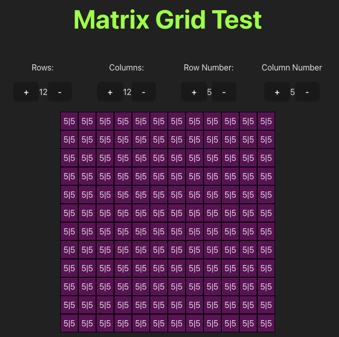

  

# General Assembly Project 4: Synth Sounds

## Brief
-
- The app utilises Django templates for rendering templates to users.
- PostgreSQL is used as the database management system.
- The app uses Django’s built-in session-based authentication.
- Authorisation is implemented in the app. Guest users (those not signed in) should not be able to create, update, or delete data in the application or access functionality allowing those actions.
- The app has at least one data entity in addition to the User model. At least one entity must have a relationship with the User model.
- The app has full CRUD functionality.
- The app is deployed online so that the rest of the world can use it.
### Project Members:

* Matt Lamb

### Timeframe:

* 7 Days

#### Goal:

Create a full-stack CRUD React application with Django and PostgreSQL, using Django’s built-in session-based authentication. The app will have one data entity in addition to the User model and contain a one-to-many or many-to-many relationship with the User model.

# SynthSounds

  
SynthSounds is an experimental synthesiser that allows micro-tuning [(click to navigate to 'Warp' section for further explanation)](#Warp).

### Concept

For my final project I wanted to try something that wasn't just a CRUD app. I thought about how I could incorporate my musical interest into this and came up with two ideas, a...... .eventually settling on the synthesiser.

I wanted SynthSounds to be a customisable music synthesiser that abstracted away musical notations to allow experimentation based on the sounds rather than their placement in keys and scales. So instead of having the more familiar black and white piano notes, everything is expressed in a grid with numbers (the musical frequencies in Hertz). The lower the number, the lower the pitch.

### Deployed version:

  

[Synth-Sounds homepage](https://synth-sounds.netlify.app/)
[Quickplay](https://synth-sounds.netlify.app/synth)
  

## Technologies and Dependencies

#### Front-End

- JavaScript
- React
- Tone.js
- HTML
- CSS
- Axios
- React-dom
- React-router-dom
- React-toastify
- Bulma

#### Back-End ([GitHub Link](https://github.com/Polynomial-B/synth-app-backend))

- Python
- PostgreSQL
- Django
- Psycopg2
- Djangorestframework
- Python-dotenv
- JWT
- Django-cors-headers
- Django-on-heroku


## Planning & Build

### Planning

##### Discarded Atonal Matrix

My initial idea was to create a  matrix generator for [atonal](https://en.wikipedia.org/wiki/Atonality) music whereby the user would choose _all_ the notes in the 'Western' musical [scale](https://en.wikipedia.org/wiki/Chromatic_scale) and the generator would calculate the outputs as determined in atonal music ([prime, retrograde, inversion, retrograde inversion](https://musictheory.pugetsound.edu/mt21c/TwelveToneTechnique.html)). The user would then be able to play back these notes in order to create an Atonal piece of music.

After successful python testing, I decided to discard this idea because I thought the inaccessibility of the genre and presumption of music theory would make this difficult to 'pick up and play' for someone who hadn't come across the idea before. I also found that the idea was quite restrictive and I instead wanted something more free and experimental. On top of this, atonal matrix calculators already exist online.

##### Experimental Synth

I started with [tests](#Appendix) in Python to create grids and calculate...

If you want some reference to a musical keyboard:


The musical note 'A' (or 'La' in solfège) is 110Hz, 220Hz, 440Hz, etc.


You may have noticed that the frequency of a note in any given octave is double that of the octave below it, which is something that I had to consider when programming the 'warp'. The logarithmic scaling required additional logic when programming the 'warp' feature.

  

#### Warp

*Warp* allows you to change the amount of notes in each octave. Each octave usually contains `12` notes but with _warp_ you can change the number of divisions to discover different scales that are not usually seen inside of 'Western' music.

  

##### Ditching the Piano Keyboard

  

When I talk about 12-Tone, I am referring to the amount of notes in an octave. For example, if you see the keyboard image below you will see that the notes go from 1 up to 12. This is how most instruments are tuned as it provides us with familiar sounding tones.

  


  

So abstracting away from the standard keyboard, we could imagine the keyboard instead of having two rows (black keys and white keys), just as having one row instead.

  


  

Now imagine that instead of having 12 notes in each octave, that we have six. So you can't play from 1-12, but only from 1-6. But in both cases you end up in the same place. This is what I mean when I talk about the intervals. We are still working within the octaves but we're dividing differently.

  


  

In the above example, we can see that we could replicate this on a normal keyboard by just ignoring every other note (playing every even or odd note). But this is where the 'warp' feature becomes more interesting. Instead of having 6 notes in the octave, why not try having 5 or 15 or 17?

  
  
  
  

### Build

#### Constructing the Synth

Using the Tone.js library, I was able to able to build a basic synth using JavaScript classes in the following structure:

1. The synth class was created
2. The class was 'linked' to the audio output source
3. The synth is triggered, with a specified pitch (C4) and length (8n - 8th note)

```
const Synth = new Tone.Synth().toDestination()
Synth.triggerAttack("C4", "8n")
```

As I wanted the note length to be chosen by the user, I had to make use of the `triggerAttack()` and `triggerRelease()` functions, which I assigned to `handleClick` and `handleMouseOff` functions.

For `onMouseDown`, `onTouchStart` and `onChange`:

``` JavaScript
async function handleClick(e) {
	let noteToPlay = e.target.innerText;
	if (noteToPlay === "") {
		return;
	} else {
		await Tone.start();
		Synth.triggerAttack(`${noteToPlay}`);
	}
}
```

For `onMouseUp` and `onTouchEnd`:

``` JavaScript
function handleMouseOff() {
	Synth.triggerRelease();
}
```

After testing I had to add `onMouseLeave` to `handleMouseOff` because a bug occurred where if you press and held a note and then left the grid area, then the note would play continuously.

%% #### Mapping Frequencies to the Grid

.... %%

#### Warp Calculation

  

``` JavaScript

function handleWarp(e) {
		function updateFreqArray() {
		let equalTemperament = divisions;
	
		if (e.target.value === "+") {
			equalTemperament += 1;
			setDivisions(equalTemperament);
		} else if ((e.target.value === "-") && (divisions > 5)) {
			equalTemperament -= 1;
			setDivisions(equalTemperament);
		}
		
		let temperament;
		
		function calculateEqualTemperament() {
			temperament = (2 ** (1/equalTemperament));
		}
		calculateEqualTemperament()
		
		let newArray = [11000]; // 11000 is our the frequency (A)
		
		for (let i = 0; i < 32; i++) {
			newArray.push(Math.round(newArray[i] * temperament));
		}
		setWarpFreqs(newArray);
		
		const newFormData = structuredClone(formData);
		newFormData.freqs = newArray;
		setFormData(newFormData);
		}
		
	updateFreqArray();
}

```

 For user experience, I chose to limit the divisions in an octave to anything over 5 was due to the fact that in a grid of 32, if the divisions are less than 5 then the higher frequencies go to the higher end of the human hearing range and enter a range that sounds harsh to listen to.
 
With 12 divisions:
* Lowest: $110$
* Highest: $659.22$

With 5 divisions:
* Lowest: $110$
* Highest: $8086.92$

You can check for yourself by adjusting the 'warp' down to 5 and playing notes above $1000$ Hz on [the Synth](https://synth-sounds.netlify.app/synth).

### Linear or Logarithmic?

  

#### Linear Tests

  

For brevity, the code for some of these tests have been added to the [Appendix](#testing-with-linear-divisions).

#### Calculating the Equal Temperament

  

For 12-Tone:

  

This is done inside of the above function by dividing the octave into 12 parts, all of which are equal, with a ratio equal to the 12th root of 2:

  

$\sqrt[12]{2}​$ ≈ 1.05946

To calculate the 12-Tone, I did it as follows:

  

$2^{1/12}$ ≈ 1.05946

  

This can be changed dynamically through use of the function:

  

``` JavaScript

function calculateEqualTemperament() {

temperament = (2 ** (1/equalTemperament));

}

calculateEqualTemperament()

```

  
  
  

## Accreditations

The placeholder text on the home page, underneath the volume warning, comes from Wikipedia.

## Bugs, Wins & Challenges

### Wins
##### Warp

==I was most happy with the 'Warp' feature, that I mostly built on my phone's 'Notes' app while on a bus. I managed to work out the ==


### Bugs

Warp under 5: Perhaps a better way to do this would have been to add logic that prevents the `for` loop from pushing numbers in that are above a certain frequency and still allow users to choose divisions of less than 5.


This project was a challenging endeavour as I built the app using libraries and features that I hadn't used before and, within the timeframe, I was unable to fully test edge cases. I would approach this project differently if I had more time.
  

##### Bulma Conflict Issues

Issues with Bulma and the select box, conflicting the z-index of the header. In the end i removed the bulma class `select` and opted to manually style it myself

  

##### Warp in Collection

Navigating from Collection to a saved synth (Tinker) The Warp useState is set to '12' which doesn't account for if the number of divisions has been changed by the user. If you were to create a Synth that had 5 divisions per octave, you can save it to your collection and it will play correctly, but the divisions amount will say that is it '12' and if you click 'Warp' then it will revert the divisions back to '12'. This would be an easy fix, through updating the useState to the data received from the backend in the useEffect hook. This could be done by updating the useEffect state upon.

  

onTouchEnd

On mobile devices the onTouchEnd

  

## Key Learnings, Improvements & Future Features

### Key Learnings

Tone.js -- an unfamiliar library
Experience with React, props, hooks
### Improvements

##### Refactoring

Due to time constraints I wasn't able to do as much as I wanted.

``` JavaScript
const formMappings = {
	attack: 0,
	decay: 1,
	sustain: 2,
	release: 3,
};
```

``` JavaScript
if (
	name.includes("attack") ||
	name.includes("decay") ||
	name.includes("sustain") ||
	name.includes("release")
) {
	newFormData.a_d_s_r[formMappings[name]] = value;
```

This could use further refactoring by using a `for` loop to iterate over each key pair and removing the need for the OR operators.

The same principal should also be applied to the effects, within the same `handleChange` function.

##### Synth Access for Guests

Guests should be able to use the synth without having to sign in (or using the URL). This is not a permissions problem, as can be seen in the the Django REST Framework  `views.py`:

``` Python
class SynthListView(APIView):
	permission_classes = (IsAuthenticatedOrReadOnly, )
```

The fix would require removing the `isLoggedIn` along with the `&&` short-circuiting (below), then some conditional rendering to remove the 'Save Synth' button.

``` JavaScript
{isLoggedIn && (
	<Link to="/synth" className="button" draggable="false">
	Create Synth
	</Link>
)}
```

### Future Features

The Sequencer - which already has the schema/backend made.


  

For further usability:
* piano
* pad
* marimba
* xylophone

Ability to toggle on/off the effects

More effects:

* clean delay

* bitcrusher

* reverb

  

Ability to alter ratio between notes (equal temperament or not). This could easily be implemented by adding some useState and changes to the logic.

  

Keyboard mapping

  


  
  

## Appendix

  

[Link back up to 'Build'](#Build)

#### Discarded Atonal Matrix

The initial idea was to create a 12-Tone matrix generator for [atonal](https://en.wikipedia.org/wiki/Atonality) music whereby the user must choose _all_ the notes in the 'Western' musical [scale](https://en.wikipedia.org/wiki/Chromatic_scale) and the generator would calculate the outputs ([prime, retrograde, inversion, retrograde inversion](https://musictheory.pugetsound.edu/mt21c/TwelveToneTechnique.html)). The user would then be able to play back these notes in order to create an Atonal piece of music.


I discarded this idea because the required user learning to understand the concept would have made the user experience quite low.

  

##### Matrix Example (unfinished)

  



  

##### Basic Grid Creation

  

``` Python

iterations = int(input("Iterations: "))

  

char = str(input("Choose a character: "))

  

invert = str(input("Invert: y/n: "))

  

adjust_position = str(input("Offset? y/n: "))

  

offset_number = 0

  

  

if adjust_position == "y" or adjust_position == "Y":

  

offset_number = int(input("Choose offset number, from 1-9: "))

  

  

print(f"Offsetting by {offset_number}")

  

  

if invert == "y":

  

is_inverted = True

  

else:

  

is_inverted = False

  

  

for i in range(iterations):

  

if invert == False:

  

print()

  

for j in range(iterations):

  

if i == j:

  

print(char, end='\t')

  

if i != j:

  

print(" ", end='\t')

  

else:

  

print()

  

for j in range(iterations):

  

if i != j:

  

print(char, end='\t')

  

if i == j:

  

print(" ", end='\t')

```

  
  

### Testing with Linear Divisions

  

##### Calc.py

  

``` Python

divisions = 12

freq_low = 220 # A3

freq_high = 440 # A4

  

def freq_calc(min, max, divisions):

divide_amount = max - min

calc_result = divide_amount / divisions

print(f'Division amount: {calc_result:.3f}')

return calc_result

  

calc_result = freq_calc(freq_low, freq_high, divisions)

  

i=0

while i <= divisions

print(f'{freq_low:.3f}')

freq_low = freq_low + calc_result

i += 1

  

# Results:

  

Division amount: 18.333

220.000

238.333

256.667

275.000

293.333

311.667

330.000

348.333

366.667

385.000

403.333

421.667

440.000

  

```

  
  

### Linear divisions

### A3 - A4

  

Results from `calc.py` (above) :

* Divisions per octave: 12

* Increment: 18.333

  

| *Frequency (Hz)* | *Pitch* | Deviation (cents) |

| ---------------- | ------- | ----------------- |

| 220 | A | 0.0 |

| 238.333 | A# | +38.57 |

| 256.667 | C | -33.12 |

| 275.000 | C# | -13.68 |

| 293.333 | D | -1.95 |

| 311.667 | D# | 3 |

| 330.000 | E | 1.95 |

| 348.333 | F | -4.44 |

| 366.667 | F# | -15.63 |

| 385.000 | G | -31.17 |

| 403.333 | G | 49.36 |

| 421.667 | G# | 26.32 |

| 440.000 | A | 0.0 |

  
  

### Logarithmic Divisions

  

Below is the table of notes commonly heard in 'western' music:

  

| Octave / Note | 0 | 1 | 2 | 3 | 4 | 5 | 6 | 7 | 8 |

| ------------- | --- | --- | --- | --- | --- | --- | ---- | ---- | ---- |

| C | 16 | 33 | 65 | 131 | 262 | 523 | 1047 | 2093 | 4186 |

| C♯ | 17 | 35 | 69 | 139 | 277 | 554 | 1109 | 2217 | 4435 |

| D | 18 | 37 | 73 | 147 | 294 | 587 | 1175 | 2349 | 4699 |

| D♯ | 19 | 39 | 78 | 156 | 311 | 622 | 1245 | 2489 | 4978 |

| E | 21 | 41 | 82 | 165 | 330 | 659 | 1319 | 2637 | 5274 |

| F | 22 | 44 | 87 | 175 | 349 | 698 | 1397 | 2794 | 5588 |

| F♯ | 23 | 46 | 93 | 185 | 370 | 740 | 1480 | 2960 | 5920 |

| G | 25 | 49 | 98 | 196 | 392 | 784 | 1568 | 3136 | 6272 |

| G♯ | 26 | 52 | 104 | 208 | 415 | 831 | 1661 | 3322 | 6645 |

| A | 28 | 55 | 110 | 220 | 440 | 880 | 1760 | 3520 | 7040 |

| A♯ | 29 | 58 | 117 | 233 | 466 | 932 | 1865 | 3729 | 7459 |

| B | 31 | 62 | 123 | 247 | 494 | 988 | 1976 | 3951 | 7902 |

  

Let's compare our equal divisions to those seen above.

  

The case for a logarithmic method to divide the frequencies:

  

==explain==

  
  

Wolf intervals with 'just tuning'