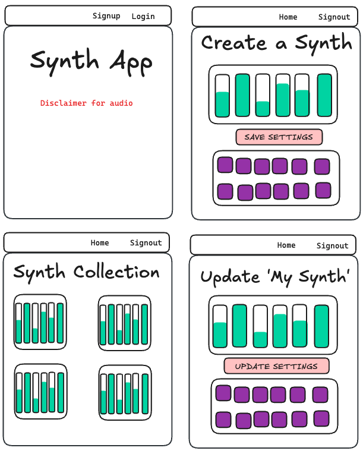
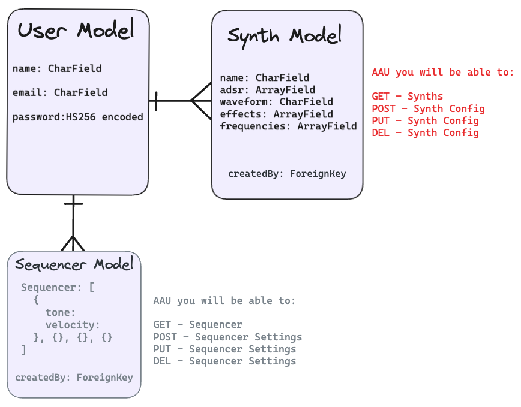
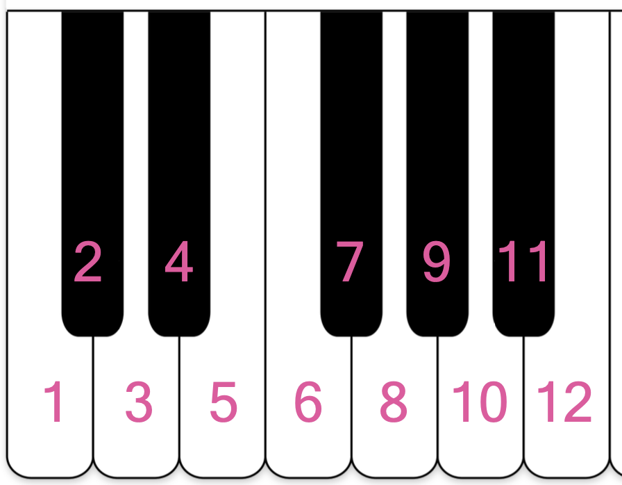
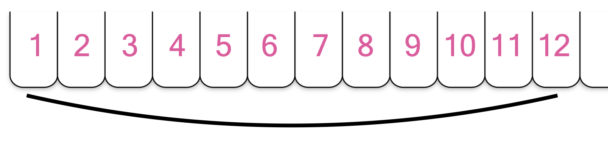
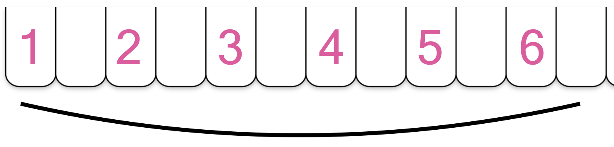

  

# General Assembly Project 4: Synth Sounds

## Brief

- The app utilises Django templates for rendering templates to users.
- PostgreSQL is used as the database management system.
- The app uses Django’s built-in session-based authentication.
- Authorisation is implemented in the app. Guest users (those not signed in) should not be able to create, update, or delete data in the application or access functionality allowing those actions.
- The app has at least one data entity in addition to the User model. At least one entity must have a relationship with the User model.
- The app has full CRUD functionality.
- The app is deployed online so that the rest of the world can use it.
### Project Members:

* Matt Lamb

### Timeframe:

* 9 Days

#### Goal:

Create a full-stack CRUD React application with Django and PostgreSQL, using Django’s built-in session-based authentication. The app will have one data entity in addition to the User model and contain a one-to-many or many-to-many relationship with the User model.

# SynthSounds

  
SynthSounds is an experimental synthesiser that allows micro-tuning [(click to navigate to 'Warp' section for further explanation)](#Warp).

### Concept

For my final project I wanted to try something that wasn't just a CRUD app. I thought about how I could incorporate my musical interest into this and came up with two ideas, eventually settling on a grid-based synthesiser.

I wanted SynthSounds to be a customisable music synthesiser that abstracted away musical notations to allow experimentation based on the sounds rather than their placement in keys and scales. So instead of having the more familiar black and white piano notes, everything is expressed in a grid with numbers (the musical frequencies in Hertz). The lower the number, the lower the pitch.

### Deployed version:

  

[Synth-Sounds homepage](https://synth-sounds.netlify.app/)
[Quick play (no login required)](https://synth-sounds.netlify.app/synth)
  
## Technologies and Dependencies

#### Front-End

- JavaScript
- React
- Tone.js
- HTML
- CSS
- Axios
- React-dom
- React-router-dom
- React-toastify
- Bulma

#### Back-End ([GitHub Link](https://github.com/Polynomial-B/synth-app-backend))

- Python 3
- PostgreSQL
- Django
- Psycopg2
- Djangorestframework
- PyJWT
- Django-cors-headers
- Django-on-heroku

## Planning & Build

### Planning (Day 1)

#### Idea 1: Atonal Matrix

My initial idea was to create a  matrix generator for [atonal](https://en.wikipedia.org/wiki/Atonality) music whereby the user would choose _all_ the notes in the 'Western' musical [scale](https://en.wikipedia.org/wiki/Chromatic_scale) and the generator would calculate the outputs as determined in atonal music ([prime, retrograde, inversion, retrograde inversion](https://musictheory.pugetsound.edu/mt21c/TwelveToneTechnique.html)). The user would then be able to play back these notes in order to create an Atonal piece of music.

However, after successful Python testing, I decided to abandon the idea because I felt the genre's inaccessibility and the need for prior music theory knowledge would make it difficult to 'pick up and play'.

#### Idea 2: Experimental Synth

I wanted to create a synthesiser that maintained familiarity with everyday tones, so that it wasn't too inaccessible. I came up with the idea to be able to increase and decrease the amount of notes available inside each musical octave.

##### Wireframe



##### ERD




##### Warp

*Warp* allows you to change the amount of notes in each octave. Each octave usually contains `12` notes (see 'Standard Keyboard' image) but with _warp_ you can change the number of divisions to discover different scales that are not usually seen inside of 'Western' music.


###### Standard Keyboard



  

So abstracting away from the standard keyboard, we could imagine the keyboard instead of having two rows (black keys and white keys), just as having one row instead.




###### Different Divisions

Below there are only six notes per octave instead of twelve. You end up in the same place after going up the keyboard in 6 steps (as opposed to 12).




  

In the above example, we can see that we could replicate this on a normal keyboard by just ignoring every other note (playing every even or odd note) because 6 divides evenly into 12. But this is where the 'warp' feature becomes more interesting. Instead of having 6 notes in the octave, why not try having 5 or 15 or 17?

#### Divisions

I started with tests in Python using `pyaudio` to calculate and output frequencies with linear divisions. However, I decided to opt instead for logarithmic divisions between the notes to maintain a familiarity with the sounds (as this is the standard in 'western music').

##### Linear Divisions

``` Python
divisions = 12
freq_low = 220 # A3
freq_high = 440 # A4 

def freq_calc(min, max, divisions):
	divide_amount = max - min
	calc_result = divide_amount / divisions
	print(f'Division amount: {calc_result:.3f}')
	return calc_result 

calc_result = freq_calc(freq_low, freq_high, divisions)

i = 0
while i <= divisions
	print(f'{freq_low:.3f}')
	freq_low = freq_low + calc_result
	i += 1 

# Calculation Results:

Division amount: 18.333
220.000
238.333
256.667
275.000
293.333
311.667
330.000
348.333
366.667
385.000
403.333
421.667
440.000
```

##### Logarithmic Divisions (Equal Temperament)

To calculate the divisions of the standard western scale, I used the ratio equal to the 12th root of 2:

$\sqrt[12]{2}​$ ≈ 1.05946

In the frontend, I did it as follows:

$2^{1/12}$ ≈ 1.05946

This can be changed dynamically through use of the function depending on what divisions the user requests:


``` JavaScript
function calculateEqualTemperament() {
	temperament = (2 ** (1/equalTemperament));
}
```

### Build

To keep track of the build I used [Trello](https://trello.com/b/Z5tLHQq6/synth).

#### Backend (Day 2 - 3)

I built the backend using Django REST Framework to create a RESTful API that utilised PostgreSQL as a database (to be deployed through Heroku) and authentication using JSON Web Tokens. I included three models, two of which were for immediate use, the User model `jwt_auth` and `synth`. The third model, `sequencer`, was included for future application.

I used Postman to ensure that all endpoints were being accessed with the correct JSON responses.
###### `synths/views.py`

``` Python
class SynthListView(APIView):
	permission_classes = (IsAuthenticatedOrReadOnly, )
	
	def get(self, request):
		synths = Synth.objects.filter(owner=request.user.id)
		serialized_synths = SynthSerializer(synths, many=True)
		return Response(serialized_synths.data, status=status.HTTP_200_OK)
	
	def post(self, request):
		request.data["owner"] = request.user.id
		
		synth_to_add = SynthSerializer(data=request.data)
		
		try:
			synth_to_add.is_valid()
			synth_to_add.save()
			return Response(synth_to_add.data, status=status.HTTP_201_CREATED)
		except Exception as e:
			print("Error")
			return Response(e.__dict__ if e.__dict__ else str(e), status=status.HTTP_422_UNPROCESSABLE_ENTITY)
```

###### `synth/models.py`

I initially did not consider`JSONField` but found that it was easy to add to the model and proved effective in dealing with the 'effects' field which by default is an empty list of dictionaries. This helped with coding the frontend, meaning that I could choose the effects during the frontend build process without having to update the models every time I wanted to add a different effect.

``` Python
class Synth(models.Model):
	def __str__(self):
		return f'{self.name}'
	
	name = models.CharField(max_length=80)
	a_d_s_r = ArrayField(models.IntegerField())
	waveform = models.CharField(max_length=20)
	effects = ArrayField(
		models.JSONField(default=dict),
		blank=True,
		null=True
	)
	
	freqs = ArrayField(models.IntegerField())
	
	owner = models.ForeignKey(
	'jwt_auth.User',
	related_name="synth",
	on_delete=models.CASCADE
	)
```


Django as a framework felt structured and efficient to use and enabled me to complete the models with relative ease.

#### Frontend (Day 3-9)

##### Linking to the Backend

I used Axios to make RESTful requests between React to Django/PostgreSQL using JWT authentication for the `detailed.


#####  Building the Synth

Using the Tone.js library, I was able to able to build a basic synth using JavaScript classes in the following structure:

1. The synth class was created
2. The class was 'linked' to the audio output source
3. The synth is triggered, with a specified pitch (C4) and length (8n - 8th note)

```
const Synth = new Tone.Synth().toDestination()
Synth.triggerAttack("C4", "8n")
```

As I wanted the note length to be chosen by the user, I had to make use of the `triggerAttack()` and `triggerRelease()` functions, which I assigned to `handleClick` and `handleMouseOff` functions.

For `onMouseDown`, `onTouchStart` and `onChange`:

``` JavaScript
async function handleClick(e) {
	let noteToPlay = e.target.innerText;
	if (noteToPlay === "") {
		return;
	} else {
		await Tone.start();
		Synth.triggerAttack(`${noteToPlay}`);
	}
}
```

For `onMouseUp` and `onTouchEnd`:

``` JavaScript
function handleMouseOff() {
	Synth.triggerRelease();
}
```

After building and testing, I had to add `onMouseLeave` to `handleMouseOff` because a bug occurred where if you press and held a note and then left the grid area, then the note would play continuously.
##### Warp Calculation

``` JavaScript

function handleWarp(e) {
		function updateFreqArray() {
		let equalTemperament = divisions;
	
		if (e.target.value === "+") {
			equalTemperament += 1;
			setDivisions(equalTemperament);
		} else if ((e.target.value === "-") && (divisions > 5)) {
			equalTemperament -= 1;
			setDivisions(equalTemperament);
		}
		
		let temperament;
		
		function calculateEqualTemperament() {
			temperament = (2 ** (1/equalTemperament));
		}
		calculateEqualTemperament()
		
		let newArray = [11000]; // 11000 is our the frequency (A)
		
		for (let i = 0; i < 32; i++) {
			newArray.push(Math.round(newArray[i] * temperament));
		}
		setWarpFreqs(newArray);
		
		const newFormData = structuredClone(formData);
		newFormData.freqs = newArray;
		setFormData(newFormData);
		}
		
	updateFreqArray();
}

```

 For user experience, I chose to limit the divisions in an octave to anything over 5 was due to the fact that in a grid of 32, if the divisions are less than 5 then the higher frequencies go to the higher end of the human hearing range and enter a range that sounds harsh to listen to.
 
With 12 divisions:
* Lowest: $110$
* Highest: $659.22$

With 5 divisions:
* Lowest: $110$
* Highest: $8086.92$

You can check for yourself by adjusting the 'warp' down to 5 and playing notes above $1000$ Hz on [the Synth](https://synth-sounds.netlify.app/synth). The higher up that the notes get, the more harsh and unpleasant they sound.

## Accreditations

The placeholder text on the home page, underneath the volume warning, comes from Wikipedia.

## Bugs, Wins & Challenges

### Wins
##### Warp

I was most happy with the 'Warp' feature. I researched the logarithmic formula and then coded this on my phone's 'Notes' app while on a bus, so I was excited that I managed to get it working when I transferred it to my IDE.
### Bugs

Warping under 5 divisions per octave: Perhaps a better way to do this would have been to add logic that prevents the `for` loop from pushing numbers in that are above a certain frequency and still allow users to choose divisions of less than 5.


This project was a challenging endeavour as I built the app using libraries and features that I hadn't used before and, within the timeframe, I was unable to fully test edge cases.

##### Bulma Conflict Issues

Issues with Bulma and the select box, conflicting the z-index of the header. In the end I removed the bulma class `select` and opted to manually style it myself

  

##### Warp in Collection

Navigating from Collection to a saved synth (Tinker) The Warp useState is set to '12' which doesn't account for if the number of divisions has been changed by the user. If you were to create a Synth that had 5 divisions per octave, you can save it to your collection and it will play correctly, but the divisions amount will say that is it '12' and if you click 'Warp' then it will revert the divisions back to '12'. This would be an easy fix, through updating the useState to the data received from the backend in the useEffect hook. ==This could be done by updating the useEffect state upon...==

  

onTouchEnd

On mobile devices the onTouchEnd

  

## Key Learnings, Improvements & Future Features

### Key Learnings

My main takeaway from this project is that working with an unfamiliar library and reading  

Tone.js -- an unfamiliar library
Experience with React, props, hooks
### Improvements

##### Refactoring

Due to time constraints I wasn't able to refactor the code as much as I would have liked.

I created a `formMappings` object in order to update the form data, rather than having to apply logic for each individual form parameter. 

``` JavaScript
const formMappings = {
	attack: 0,
	decay: 1,
	sustain: 2,
	release: 3,
};
```

``` JavaScript
if (
	name.includes("attack") ||
	name.includes("decay") ||
	name.includes("sustain") ||
	name.includes("release")
) {
	newFormData.a_d_s_r[formMappings[name]] = value;
```

This could be further improved by adding a `for` loop to iterate over each key pair and removing the need for the OR operators (`||`) in the `if` statement.

The same principal should also be applied to the effects, within the same `handleChange` function, by adding an `effectsMappings` object (and renaming `formMappings`, e.g. `adsrMapping`).

##### Synth Access for Guests

Guests should be able to use the synth without having to sign in (or typing the URL). This is not a permissions problem, as can be seen in the the Django REST Framework  `views.py`:

``` Python
class SynthListView(APIView):
	permission_classes = (IsAuthenticatedOrReadOnly, )
```

The fix would require removing the `isLoggedIn` along with the `&&` short-circuiting (below), then some conditional rendering,  to remove the 'Save Synth' button, and error handling.

``` JavaScript
{isLoggedIn && (
	<Link to="/synth" className="button" draggable="false">
	Create Synth
	</Link>
)}
```

### Future Features
#### Sequencer

The Sequencer, which already has the model created in Django, could be added to the frontend. This would allow the user to take their Synthesiser settings and program the sounds to play back in a certain order, allowing for parameters such as:
* Frequency (the pitch of the note)
* Velocity (the volume of the note)
* Length (how long the note lasts)

#### Default sound settings

For user experience, including preset sounds should be added. For example, when you are on the synth page you should be able to choose to 'customise' the effects or choose from presets. For example:
* Piano
* Cello
* Marimba
* Saxophone

#### Effects

##### Multiple effects parameters

You should be able to adjust more than just one parameter for the effects. It's coded into the frontend and backend, but the form currently only allows you to manipulate one value. See the examples for chorus and feedback (delay) below:

The data being sent to the backend:

``` JavaScript
effects: [
	{ distortion: 1 },
	{ chorus: [4, 0, 0.0] },
	{ feedback: [0.01, 0.5] },
],
```

The only data that can be changed by the user:

``` JavaScript
// function handleChange(e) { ...

} else if (name === "chorus") {
	newFormData.effects[1].chorus = value;
} else if (name === "delay") {
	newFormData.effects[2].feedback[0] = value;
}
```

##### Toggle effects

You should be able to turn on/off the effects. Even at the lowest amount, the chorus effect is still noticeable as the synth currently stands. Including a toggle function which removes the toggled effect class from the 'chain' would solve this. 
##### Effect options

To allow further experimentation, the user should be able to have a wider range of effects to choose from. For example:
* Clean delay
* Bitcrush
* Reverb

##### Division ratio adjustment

The user should be able to alter the ratio between the notes, i.e. whether they are using equal temperament or not. This could be implemented by adding `useState` and changes to the `equalTemperament` function's logic.

##### Keyboard mapping

To increase desktop user experience, the keys could be mapped to the approximate 26 character keys on a standard keyboard. This could be achieved by utilising a loop and adjusting the logic to generate frequencies within the grid, reducing the range from 32 down to the number of keys on the keyboard.